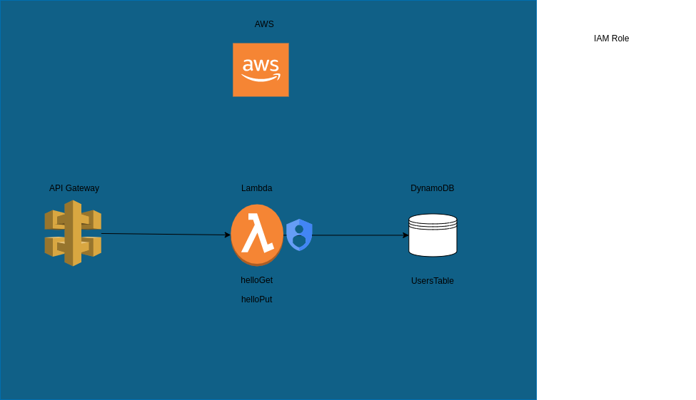

# hello-lambda

This solution uses serverless to deploy a lambda, setup api gateway and a dynamoDb table that the lamba uses to store the user data.

There are some basic unit tests that cover most of the functionality.

[Please see the developer guild to run the project locally](docs/developer_guild.md)

Deployment scripts have been built into a github actions workflow, [readme can be found here](docs/cicd_pipeliine.md).